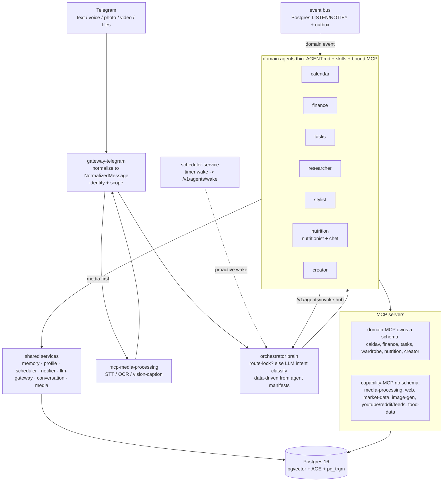

# ai-life — project reference

A consolidated, two-lens overview of the system: first for a **developer**, then for a **user** who
wants to try it. This is a snapshot (2026-06-25); the authoritative, always-current sources are
[`plans/architecture.md`](../plans/architecture.md) (design), [`plans/roadmap.md`](../plans/roadmap.md)
(stages), and [`plans/STATUS.md`](../plans/STATUS.md) (in-flight). When this file and `plans/` disagree,
`plans/` wins — keep this file light and link out rather than restating detail (README-drift discipline).

---

## Part 1 — for a developer

### What it is

Personal AI-agent system for a 2-person household, local-first (target host: Mac Studio 128 GB). Entry
point is Telegram (text/voice/photo/video/files). Flow:

**Telegram → gateway → orchestrator ("brain") → domain agents → narrow MCP servers → Postgres.**

Java 21 / Spring Boot 3.4 / Spring AI. Monorepo but **not a monolith** — every agent and every MCP is
its own Spring Boot app in its own container, depending only on `libs/*`.

### Request flow



**Reactive (a message arrived):** route-lock active (open confirmation) → resume the locked agent,
bypass classification; else LLM intent-classify (FAST channel, few-shot from manifests + memory recall)
→ one clear domain routes to one agent, complex/multi-domain is **agent-led** (a coordinator agent
gathers others through the hub `/v1/agents/invoke` or the bus). An agent may return a `pendingAction`
→ the orchestrator locks the conversation for confirmation.

**Proactive (an event arrived):** scheduler wake (`kind`) → the owning agent's trigger (birthday
reminders, budget alerts, weekly task review); or a domain event on the bus → a consumer agent reacts
(the grocery-receipt fan-out: finance + nutrition).

**Autonomy rule:** propose freely; perform any **outbound** external action (messaging others, a
purchase, a booking) only after explicit user confirmation.

### Component kinds (how to navigate the tree)

| Kind | Path | Rule |
|---|---|---|
| Cross-cutting **service** (brain + infra) | `platform/<name>` | orchestrator, gateway-telegram, llm-gateway, memory/profile/scheduler/notifier/media/conversation-service |
| **Domain agent** | `domains/<domain>/<name>-agent` | thin: AGENT.md (EN prompt) + skills + bound MCP; reasoning is the LLM |
| **domain-MCP** (owns a schema) | `domains/<domain>/mcp-<name>` | one schema + Liquibase feature |
| **capability-MCP** (no schema) | `shared/mcp/<name>` | stateless wrapper over an external surface; any agent binds it |
| **Skill** (prompt instruction) | `skills/<domain>/<name>/SKILL.md` | EN body + frontmatter |
| **Editable rule** (budgets, who-is-who) | Postgres, editable from chat | NOT a skill |

Mnemonic: **tools = MCP, reasoning = agent, instructions = skill, editable rules = data.** Two kinds of
"shared": `libs/` = compile-time Java (a dependency), `shared/` = deployable runtime capabilities.

### Locked doctrines (don't relitigate — see [architecture.md §Decisions](../plans/architecture.md))

- Agents never call each other directly — only via the orchestrator (sync) or the bus (async).
- The orchestrator is a thin, data-driven router (the LLM does the thinking); adding an agent extends
  routing with no orchestrator edit.
- LLM access only through `llm-gateway` (channels `default` / `fast` / `vision` / `embedding`; provider
  switched by env var, agents unaware).
- Media is processed at the gateway — the orchestrator always sees a unified `NormalizedMessage`.
- Polyglot-by-design but the spine stays Java; ML inference (whisper, try-on, image-gen) is "run
  upstream + thin capability-MCP", never a rewrite.

### Stages — what's done

| Stage | Status | Summary |
|---|---|---|
| **0 — foundation** | done | parent POM + libs, docker-compose infra, Liquibase + `001-core`, profile-service, `/start`, mock llm-gateway, orchestrator skeleton, CI |
| **1 — calendar** | done | `mcp-caldav` + Radicale, `mcp-ics-import` (Apple/Google read-only), `calendar-agent`, scheduler birthday trigger → notifier, gift-recommender |
| **2 — finance** | done | `finance.*`, `mcp-finance`, Money Pro CSV import, `finance-agent` + categorizer + receipt-parser, budgets + alerts, investment-advisor (advisory-only) |
| **3 — tasks (GTD)** | done | `mcp-tasks` (full GTD), `tasks-agent`, weekly review cron, catch-all inbox |
| **4 — memory + inter-agent** | done | memory-service (pgvector recall + scope), graph relations (SQL; AGE deferred), LISTEN/NOTIFY bus + outbox, conversation-state (route-lock / confirm), first Coordinator chains |
| **5 — real LLM** | **blocked** | Langfuse tracing + Anthropic/openai-compatible/Ollama providers ready; **blocked on model access** → default provider is `mock`. Golden tests on real models wait on the unblock |
| **6 — domain agents** | done (current domains) | researcher (+ `mcp-web`), stylist, nutrition (nutritionist + chef), creator — each MVP-complete. Future agents extracted to [`future-agent`](https://github.com/fedoroff-vlad/ai-life/labels/future-agent) issues |

### Live domains (current)

- **calendar** — `calendar-agent`, `mcp-caldav` (Radicale = source of truth), `mcp-ics-import`.
- **finance** — `finance-agent`, `mcp-finance`, `mcp-money-pro-import`. Own `finance.*` schema.
- **tasks** — `tasks-agent`, `mcp-tasks` (full GTD).
- **researcher** — `researcher-agent` + shared `mcp-web` (SearXNG search + jsoup fetch, cheap-first).
- **stylist** — `mcp-wardrobe` + `stylist-agent`; wardrobe catalogue, "analyse me", capsule → HTML boards.
- **nutrition** — `mcp-nutrition` + `nutritionist-agent` + `chef-agent` + shared `mcp-food-data`. Headline:
  grocery-receipt fan-out (finance + nutrition via the bus) → ration → chef recipes over the hub.
- **creator** — `mcp-creator` + `creator-agent` + sources `mcp-youtube` / `mcp-reddit` / `mcp-feeds`
  (+ `mcp-web`). Creator track, trend → ideas → drafts synthesis (HTML board), trend/draft cache, and the
  inter-agent greeting chain `calendar.birthday → creator.draft_greeting → notifier`.

Shared capability-MCPs: `mcp-media-processing` (OCR Tesseract + STT whisper sidecar + vision-caption),
`mcp-web`, `mcp-market-data` (Stooq quotes), `mcp-image-gen` (scaffolded, stub engine — real GPU engine
ahead), `mcp-food-data`.

### Not done / deferred

- **Real LLM (Stage 5)** — blocked on model access; everything runs on `mock`.
- **GPU line** — real image-gen engine, virtual try-on (CatVTON), VLM-OCR (Unlimited-OCR) — wait on a GPU host.
- **Apache AGE graph** — deferred (SQL `memory.relations` suffices).
- **creator-deferred** — Threads/Instagram/Pinterest via `mcp-browser`, post imagery, scheduling/auto-posting.
- **Future agents** — briefing / health / docs / family-memory / travel / email / smart-home, each a
  [`future-agent`](https://github.com/fedoroff-vlad/ai-life/labels/future-agent) issue.

### Build

```sh
mvn -B verify                  # full build + tests (Testcontainers spins up PG etc.)
mvn -T1C -DskipTests install   # fast local compile (respects the module DAG)
```

---

## Part 2 — for a user who wants to try it

### Honest caveat first

The system is wired **end-to-end**, but today it runs on a **mock LLM** (Stage 5 is blocked on model
access). Routing, the database, MCP tools, the event bus, schedules, and the HTML deliverables all work
for real — but **the language-model answers are deterministic stubs**, not "smart". To use it for real,
point it at a real model — a single `.env` change in `llm-gateway`:

- **free / local:** `LLM_PROVIDER=openai-compatible` → a local **Ollama** (the Mac Studio target), or
- an **Anthropic** API key.

Agents don't notice — the switch is only in `llm-gateway`.

### What it can do (with a real model connected)

| Domain | Example you type/say in Telegram |
|---|---|
| 📅 Calendar | "запиши ДР Маши 15 июля", "что у меня в пятницу", "meeting tomorrow at 15:00" |
| 💰 Finance | voice "потратил 1500 в Ленте на еду" → categorized transaction; a receipt photo → draft → confirm; "break down my spending"; Money Pro CSV import |
| ✅ Tasks (GTD) | "remind me to buy a gift" → anything not calendar/finance lands in the inbox; a weekly review arrives on its own |
| 🔎 Research | "find X" → search + article-text extraction (SearXNG, no tracking) |
| 👗 Stylist | upload wardrobe + self photos → "analyse me" (colour type, body, fabrics) + a capsule — delivered as an HTML board link |
| 🥗 Nutrition | a grocery-receipt photo → expense **and** basket KБЖУ breakdown → ration + shopping list (nutritionist) + recipes (chef). Multi-person (you / spouse / infant) |
| ✍️ Creator | "what's trending in 'English for IT', give me post ideas" → trends with links + ideas + drafts → HTML content-plan; "my niche is …" saves your track |
| 🎂 Automatic | the day before a birthday: a reminder + budget-aware gift ideas; on the day: a ready greeting text |

### How to run (locally)

1. `cd infra && docker compose up` — brings up Postgres (pgvector + AGE), Radicale, MinIO, SearXNG,
   Langfuse, and all agents/MCPs.
2. Create a Telegram bot, put the token + your `telegram_user_id` into `.env` (from `infra/.env.example`).
3. *(to make it "smart")* set a real `LLM_PROVIDER` (Ollama or Anthropic) in `.env`, restart `llm-gateway`.
4. Message the bot **`/start`** — it registers you in `core.users`.
5. Then just write / speak / send photos. One bot for both users; private scope in DM, household
   commands in a group.

### Where you actually *see* things (UI)

- **Calendar** — there is **no custom calendar UI**. Radicale is the CalDAV source of truth; you view and
  browse events in **any CalDAV client subscribed to Radicale** — Apple Calendar, Google Calendar (via
  ICS), Thunderbird, etc. Events the system creates appear there like any other calendar.
- **Finance** — no GUI yet. Two intended surfaces (see roadmap): **Grafana dashboards** over `finance.*`
  + matviews, and **dynamic HTML reports** rendered via `libs/doc-render` and sent to Telegram as a link
  (the "report template" item in the finance vision).
- **Everything else** — the "UI" is the Telegram conversation plus the HTML boards (stylist / nutrition /
  creator) delivered as links.

### Current limits for a user

- Any **outbound** action needs your confirmation — the system proposes, it won't send/buy without "yes".
- No-API socials (Threads/Instagram/Pinterest), image/video generation, virtual try-on — **not yet**.
- Without a real model, answers are stubs (see the caveat above).
